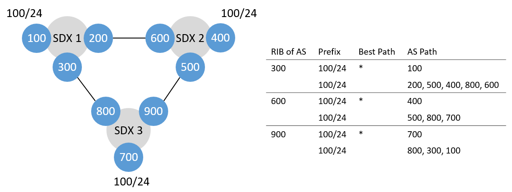

# Basic Test

## Setup


This is a basic test to see whether SIDR works as it should.

We have three SDXes with three participants each. The participants at an SDX are peering with each other. 100, 400 and 700 are advertising the prefix 100/24. We only care for the following 300, 600, 900 ASes as they all try to install the following policies amongst others:

| ID | SDX | From | To  | Match                    |
|----|-----|------|-----|--------------------------|
| 1  | 1   | 300  | 200 | TCP destination port 443 |
| 2  | 2   | 600  | 500 | TCP destination port 443 |
| 3  | 3   | 900  | 800 | TCP destination port 443 |

The policies are causing a loop. Hence, the detector should only allow to install two of them. After 60s, the link between 200 and 600 fails. Therefore, 200 withdraws the route for 100/24. This triggers the loop detector to realize that a loop isn't formed anymore.

## Run Test

### Run xctrl

```bash
$ cd 
$ python ~/SIDR/xctrl/xctrl.py test_basic 1 -d -t
$ python ~/SIDR/xctrl/xctrl.py test_basic 2 -d -t
$ python ~/SIDR/xctrl/xctrl.py test_basic 3 -d -t
```

### Submit Policy Activation Requests

```bash
$ python ~/SIDR/policy_submitter/policy_sender.py test_basic 1
$ python ~/SIDR/policy_submitter/policy_sender.py test_basic 2
$ python ~/SIDR/policy_submitter/policy_sender.py test_basic 3
```

### Clean Up

```bash
$ sudo rm ~/SIDR/xctrl/loop_detection/cibs/*
$ sudo rm ~/SIDR/xctrl/route_server/ribs/*
```
