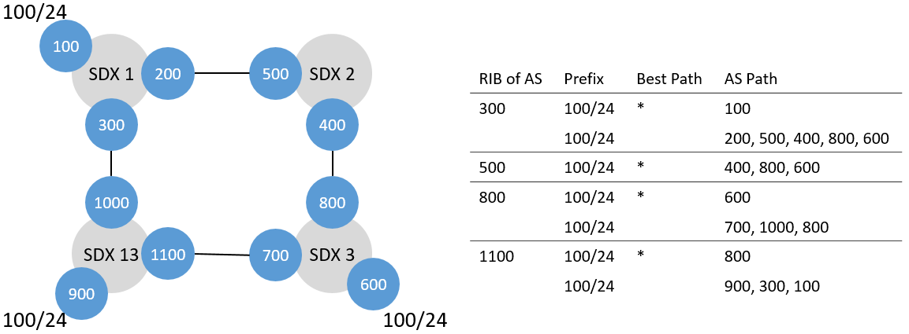

# Forward Test

## Setup


Here, we test whether an SDX without any policies/deflections correctly relays the correctness messages to the next SDX on the path. Additionally, we also test how SIDR reacts to changes in the topology (BGP updates).

We have three SDXes with three participants each and one with only two participants. The participants at an SDX are peering with each other. 100, 600 and 900 are advertising the prefix 100/24. We only care for the following 300, 500, 800, 1100 ASes as they all try to install the following policies:

| ID | SDX | From | To  | Match                    |
|----|-----|------|-----|--------------------------|
| 1  | 1   | 300  | 200 | TCP destination port 443 |
| 2  | 2   | 800  | 700 | TCP destination port 443 |
| 3  | 4   | 1100  | 1000 | TCP destination port 443 |

After 60 seconds the link between 200 and 500 fails and 200 switches to a direct link to 800.

## Run Test

### Run xctrl

```bash
$ cd 
$ python ~/SIDR/xctrl/xctrl.py test_forward 1 -d -t
$ python ~/SIDR/xctrl/xctrl.py test_forward 2 -d -t
$ python ~/SIDR/xctrl/xctrl.py test_forward 3 -d -t
$ python ~/SIDR/xctrl/xctrl.py test_forward 4 -d -t
```

### Submit Policy Activation Requests

```bash
$ python ~/SIDR/policy_submitter/policy_sender.py test_forward 1
$ python ~/SIDR/policy_submitter/policy_sender.py test_forward 2
$ python ~/SIDR/policy_submitter/policy_sender.py test_forward 3
$ python ~/SIDR/policy_submitter/policy_sender.py test_forward 4
```

### Clean Up

```bash
$ sudo rm ~/SIDR/xctrl/loop_detection/cibs/*
$ sudo rm ~/SIDR/xctrl/route_server/ribs/*
```
