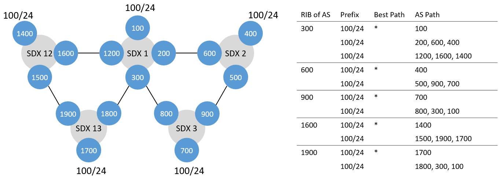

# Loops1 Test

## Setup


The two loop tests test how SIDR handles two incoming correcntess messages. In this example, there will be one correctness message from SDX 13 and one from SDX 3 coming to SDX 1 through 300. We also test how two different loops are resolved.

We have five SDXes with three participants each. The participants at an SDX are peering with each other. 100, 400, 700, 1400 and 1700 are advertising the prefix 100/24. We only care for these ASes 300, 600, 900, 1600 and 1900. They all try to install the following policies:

| ID | SDX | From | To  | Match                    |
|----|-----|------|-----|--------------------------|
| 1  | 1   | 300  | 1200 | TCP destination port 80 |
| 2  | 1   | 300  | 200 | TCP destination port 443 |
| 3  | 2   | 600  | 500 | TCP destination port 443 |
| 4  | 3   | 900  | 800 | TCP destination port 443 |
| 5  | 12  | 1600  | 1500 | TCP destination port 80 |
| 5  | 13   | 1900  | 1800 | TCP destination port 80 |


## Run Test

### Run xctrl

```bash
$ cd 
$ python ~/SIDR/xctrl/xctrl.py test_loops1 1 -d -t
$ python ~/SIDR/xctrl/xctrl.py test_loops1 2 -d -t
$ python ~/SIDR/xctrl/xctrl.py test_loops1 3 -d -t
$ python ~/SIDR/xctrl/xctrl.py test_loops1 12 -d -t
$ python ~/SIDR/xctrl/xctrl.py test_loops1 13 -d -t
```

### Submit Policy Activation Requests

```bash
$ python ~/SIDR/policy_submitter/policy_sender.py test_loops1 1
$ python ~/SIDR/policy_submitter/policy_sender.py test_loops1 2
$ python ~/SIDR/policy_submitter/policy_sender.py test_loops1 3
$ python ~/SIDR/policy_submitter/policy_sender.py test_loops1 12
$ python ~/SIDR/policy_submitter/policy_sender.py test_loops1 13
```

### Clean Up

```bash
$ sudo rm ~/SIDR/xctrl/loop_detection/cibs/*
$ sudo rm ~/SIDR/xctrl/route_server/ribs/*
```
